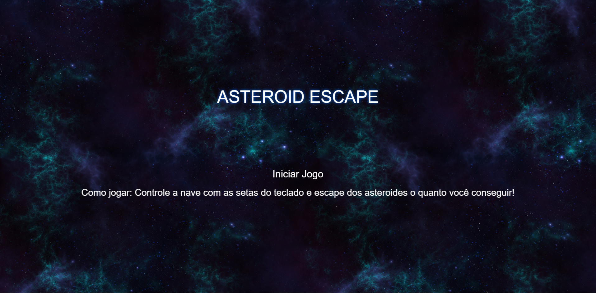
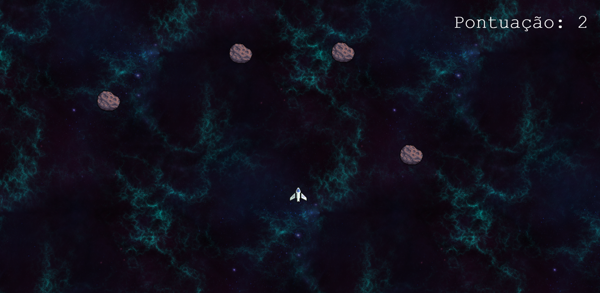
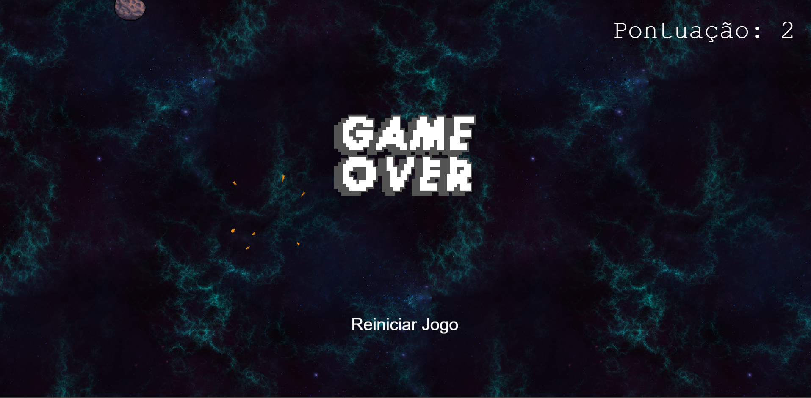

# Space Escape 🚀
[🎮 Clique aqui para jogar agora!](https://phlc26-int.github.io/Projeto_Individual_M1/)

## Sobre o Jogo
Space Escape é um jogo de nave espacial onde você precisa desviar de asteroides enquanto viaja pelo espaço. Quanto mais tempo você sobreviver, mais pontos irá somar.

## Como Jogar 🎮

### Controles
- ⬆️ Seta para cima: move a nave para cima
- ⬇️ Seta para baixo: move a nave para baixo
- ⬅️ Seta para esquerda: move a nave para esquerda
- ➡️ Seta para direita: move a nave para direita

### Objetivo
- Desvie dos asteroides 
- Sobreviva o máximo de tempo possível

### Game Over
Se sua nave colidir com um asteroide:
- O jogo termina
- Sua pontuação final é exibida no canto superior direito
- Clique no botão "Reiniciar" para jogar novamente

### Prévia do Jogo:

## Boa sorte e divirta-se! 🌟

